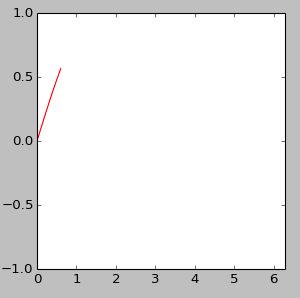

# Animations

Although a graph is a very useful tool to visualize a simulation, sometimes it's more insightful to make an animation. Python offers the possibility to redraw a figure again and again. That gives a multitude of possibilities to create movement. We will demonstrate a small example, in which we move a line (and point) along $$f(x)=sin(x)$$ over the screen. We build up the function in 3 steps, where in each step we add 1 element. With the help of these functionality you can create an array of animations.

## A moving dot

Als je een punt tekent (één $$x$$-waarde en één $$y$$-waarde) waarvan je $$x$$
en $$y$$ steeds verandert dan lijkt het of het punt over het scherm beweegt. In
de code hieronder nemen we steeds stapjes in $$x$$, rekenen $$y$$ uit en
tekenen het punt op het scherm. We gebruiken ook de commando's `xlim` en `ylim`
om in de plot aan te geven welke $$x$$-waardes en $$y$$-waardes we willen zien.

    import math
    import numpy as np
    import matplotlib.pyplot as plt
    
    # neem kleine stappen in x tussen 0 en 2pi
    for x in np.arange(0,2 * math.pi, 0.05):

        y = math.sin(x)

        # plot grafiek
        plt.plot(x, y, 'bo', markersize = 10)  # blauwe punt
        plt.xlim(0,2 * math.pi)
        plt.ylim(-1, 1)
        plt.draw()           # update grafiek
        plt.pause(0.001)
        plt.clf()            # clear grafiek

> Je ziet dat we in de code de functie `pause()` aanroepen. Dat doen we om pyplot de gelegenheid te geven de nieuwe figuur op het scherm te tekenen. Dit wordt alleen gedaan tijdens de pauzes die we geven.

## Een bewegende lijn

Een grafiek tekenen we met behulp van lijsten: een lijst met $$x$$-waardes en
een lijst met $$y$$-waardes. Als je die lijsten steeds uitbreidt dan krijg je
het onderstaande effect: de functie $$f(x) = sin(x)$$ getekend met een rode
lijn.

    import math
    import numpy as np
    import matplotlib.pyplot as plt
    
    L_x = []
    L_y = []

    # take small steps in x
    for x in np.arange(0,2 * math.pi, 0.05):

        y = math.sin(x)

        L_x.append(x)
        L_y.append(y)

        # plot grafiek
        plt.plot(L_x, L_y, 'r-')   # rode lijn
        plt.xlim(0,2 * math.pi)
        plt.ylim(-1, 1)
        plt.draw()           # update grafiek
        plt.pause(0.001)
        plt.clf()            # clear grafiek

Zoals je ziet is de code maar drie regels veranderd ten opzichte van voorbeeld
1. Het resultaat ziet er als volgt uit:

## Een stip, een lijn en tekst

Je kan de stip en de lijn ook tegelijk tekenen en op het scherm ook informatie
weergeven over de $$(x,y)$$ positie van het punt op het scherm.

    import math
    import numpy as np
    import matplotlib.pyplot as plt
    
    L_x = []
    L_y = []

    # take small steps in x
    for x in np.arange(0,2*math.pi,0.05):

        y = math.sin(x)

        L_x.append(x)
        L_y.append(y)

        # plot grafiek
        plt.plot(L_x, L_y, 'r-')               # rode lijn
        plt.plot(x, y, 'bo', markersize = 10)  # blauwe stip
        plt.xlim(0,2 * math.pi)
        plt.ylim(-1,1)

        # text op scherm      
        plt.text( 0.25, -0.8, "(%.2f,%.2f)" % (x,y) )  

        plt.draw()           # update grafiek
        plt.pause(0.001)
        plt.clf()            # clear grafiek

